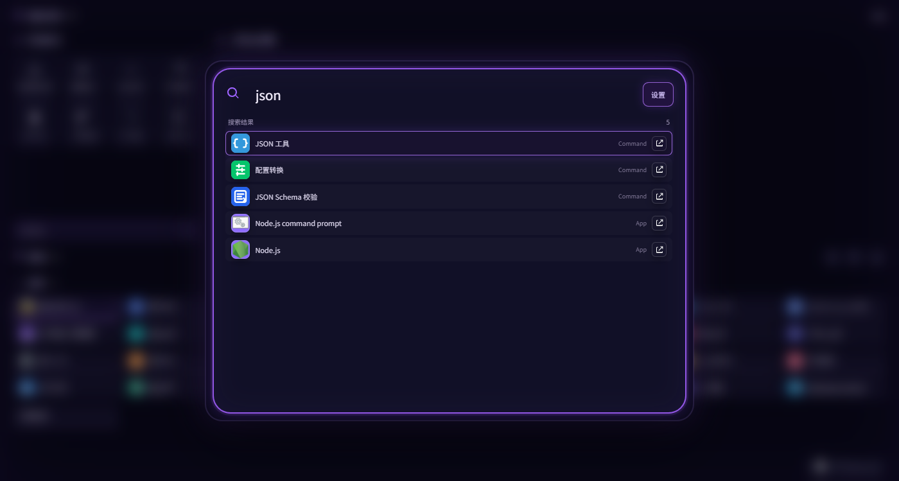
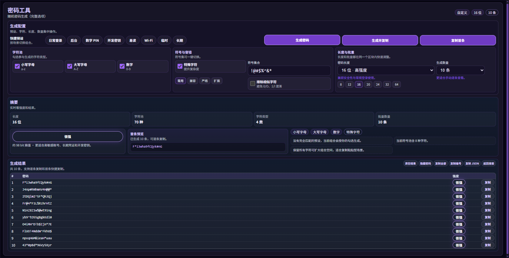
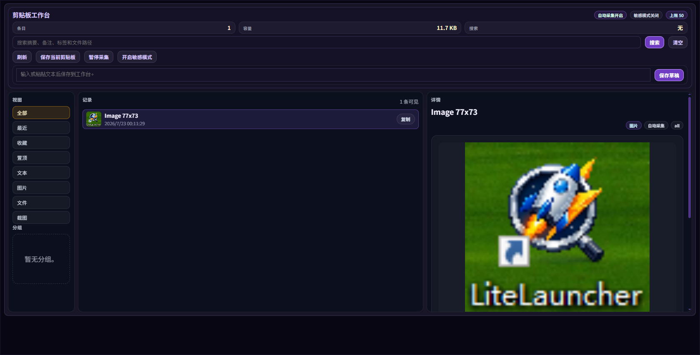

# LiteLauncher

Last updated: 2026-07-23  
Version baseline: `v1.1.4`

LiteLauncher is a lightweight Windows desktop launcher built with **Electron + TypeScript + SQLite**.  
One fast loop: **invoke → search → run**.

默认全局唤起：`Alt+Space`

---

## Screenshots

### Command Center


首页：快捷能力、全局搜索、系统入口与插件网格。

### Search



输入关键词即时检索应用、命令与插件。

### Settings · Appearance


设置中心支持外观主题预设与自定义主色，改完即时预览并持久保存。

### Settings · Plugins


按分类管理插件可见性与置顶。

### Plugin · Password



内置密码工具：预设、强度摘要、批量生成与复制。

### Plugin · Clipboard



剪贴板工作台：自动采集、分类筛选与详情预览。

---

## English

### Overview

Keyboard-first desktop launcher for Windows (macOS packaging exists in-repo).  
It combines launcher search, clipboard history, plugin panels, indexing controls, and a growing set of built-in tools in one window.

### Highlights

- Global invoke shortcut with fallback registration
- Unified search for apps, files, folders, web actions, commands, and plugins
- Command Center home: quick actions, search, system entries, plugin grid
- Search scopes: `app:`, `cmd:`, `web:`, `plugin:`
- Chinese search with initials / pinyin fragments
- Pin / unpin, run as administrator, open containing folder
- Settings groups:
  - Appearance theme (presets + custom accent)
  - Search display
  - Index scan
  - Custom pins
  - Plugin visibility
  - System & updates
  - Error logs
- Rebuild index without restart
- Unified error log capture (Main / Renderer / IPC / execute)
- Built-in tools: clipboard workbench, LiteSnap, hardware inspector, file hash, port helper, image prompt, CodeAgent Switch, and many webtools panels

### Development

```bash
pnpm install
pnpm run build
pnpm start
```

Watch mode:

```bash
pnpm dev
```

Regression:

```bash
pnpm run test:regression
pnpm run test:e2e:smoke
pnpm run test:regression:full
```

### Packaging

Windows:

```powershell
pnpm.cmd run dist:win
pnpm.cmd run dist:win:portable
```

macOS:

```bash
pnpm run dist:mac
pnpm run dist:mac:arm64
pnpm run dist:mac:x64
```

Outputs: `release/`

---

## 中文

### 项目简介

LiteLauncher 是一个基于 `Electron + TypeScript + SQLite` 的轻量桌面启动器，目标是把高频操作压缩成一条动作链：

**唤起 → 输入 → 搜索 → 执行**

当前重点是搜索稳定性、插件一致性、主题统一和自动回归，而不是继续堆功能数量。

### 主要能力

- 全局快捷键唤起（默认 `Alt+Space`，冲突时自动回退）
- 统一搜索应用、文件、文件夹、网页动作、命令和插件
- Command Center 首页：快捷能力、搜索框、系统入口、插件网格
- 搜索范围前缀：`app:`、`cmd:`、`web:`、`plugin:`
- 中文搜索增强：首字母、拼音片段、别名映射
- 结果右键：置顶 / 管理员运行 / 打开所在位置
- 设置中心：
  - 外观主题（预设 + 自定义主色）
  - 搜索展示
  - 索引扫描
  - 自定义置顶
  - 插件可见性
  - 系统与更新
  - 错误日志
- 不重启重建索引
- 统一错误日志（Main / Renderer / IPC / 执行链路）
- 内置插件：剪贴板、LiteSnap、硬件检测、文件哈希、端口助手、图片提示词、CodeAgent Switch，以及多款 WebTools 工具面板

### 常用命令

| 命令 | 作用 |
| --- | --- |
| `calc 1+2*3` | 快速计算并复制 |
| `g 关键词` | 网页搜索 |
| `clip` | 剪贴板工作台 |
| `settings` | 打开设置 |
| `hardware` / `hw` | 硬件检测 |
| `wt-json` / `wt-hash` / `wt-port` | JSON / 哈希 / 端口工具 |
| `wt-prompt` / `提示词` | 图片提示词 |
| `codex` / `codeagent` | CodeAgent Switch |
| `exit` | 退出应用 |

### 开发方式

```bash
pnpm install
pnpm run build
pnpm start
```

开发模式：

```bash
pnpm dev
```

回归检查：

```bash
pnpm run test:regression
pnpm run test:e2e:smoke
pnpm run test:regression:full
pnpm run test:cashflow
pnpm run check:encoding
```

### 截图复拍（可选）

构建完成后可用：

```bash
node scripts/capture-readme-screenshots.cjs
```

截图输出到 `docs/screenshots/`。

### 更多文档

- 功能清单与 UI 参考：[`FEATURES.md`](./FEATURES.md)
