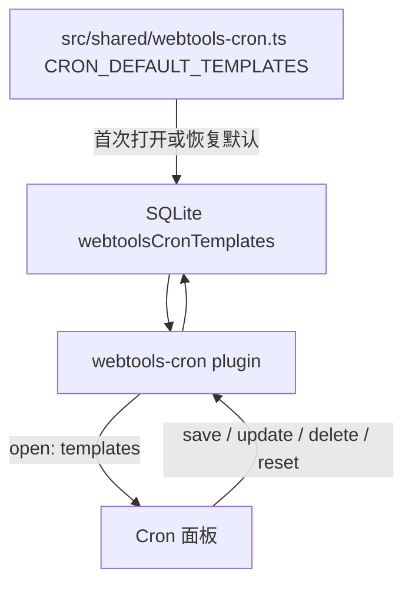
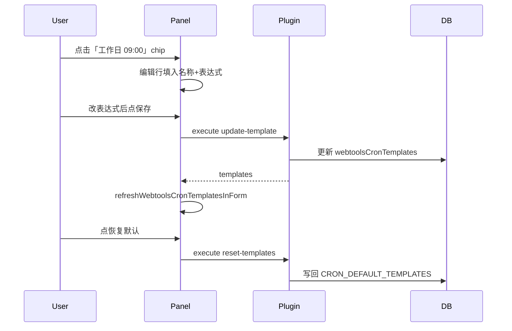

<!--
  Source of truth for LiteLauncher planning docs.
  Migrated from Cursor plan: cron_动态模板_4d6b721b.plan.md
  Local Cursor copy may still exist under ~/.cursor/plans/ — prefer this repo path.
-->
---
name: Cron 动态模板
overview: 将快速模板改为单一可编辑列表（首次/恢复默认时写入 5 条预设）；用户可新增、编辑名称与表达式、删除任意模板，并一键恢复默认；数据 SQLite 持久化，经 plugin action 完成 CRUD。
todos:
  - id: shared-cron-templates
    content: 新增 src/shared/webtools-cron.ts，定义 CronTemplateItem 与 CRON_DEFAULT_TEMPLATES（仅作种子/恢复默认）
    status: completed
  - id: cron-store
    content: 新增 store.ts + index.ts 初始化，SQLite 持久化完整模板列表（空库自动种子 5 条）
    status: completed
  - id: plugin-actions
    content: 扩展 plugin：save/update/delete/reset-templates action，matchTemplate 只读持久化列表，open 下发 templates
    status: completed
  - id: panel-ui
    content: renderer 模板区：chip 列表 + 编辑行（名称/表达式）+ 新增/更新/删除 + 恢复默认，局部刷新
    status: completed
  - id: styles
    content: 补充 template-editor-row、可编辑 chip、删除与恢复默认按钮样式
    status: completed
  - id: tests
    content: webtools-cron-plugin / store / plugin-panel-impls 回归测试（含编辑预设与 reset）
    status: completed
isProject: false
---

# Cron 快速模板：统一可编辑列表

## 用户诉求（已确认）

- **不是**「系统只读 + 用户额外添加」
- **而是**：现有 5 个预设也要能改名称和表达式；可新增、可删除任意一条
- 提供 **「恢复默认模板」**，一键还原为初始 5 条

## 现状

- 模板在 main / renderer **两处硬编码**，面板只能点击套用，无法编辑或持久化
- 相关文件：[`src/main/plugins/webtools-cron/index.ts`](src/main/plugins/webtools-cron/index.ts)、[`src/renderer/plugin-panel-impls.ts`](src/renderer/plugin-panel-impls.ts)

## 目标模型

**运行时只有一份模板列表**（存在 SQLite），不再区分 builtin / user。



- `CRON_DEFAULT_TEMPLATES`：仅用于 **种子数据** 和 **恢复默认**，不参与运行时硬编码匹配
- 用户改掉「工作日 09:00」后，列表里就是改后的内容；`matchTemplate` 按当前持久化列表匹配

## 1. 共享类型与默认种子

新建 [`src/shared/webtools-cron.ts`](src/shared/webtools-cron.ts)：

```typescript
export interface CronTemplateItem {
  key: string;       // 稳定 id，如 weekday-9am 或 user-1730...
  summary: string;   // 显示名称
  expression: string;
}

export const CRON_DEFAULT_TEMPLATES: readonly CronTemplateItem[] = [
  { key: "weekday-9am", summary: "工作日 09:00 执行", expression: "0 9 * * 1-5" },
  // ... 其余 4 条与现有一致
];

export const CRON_TEMPLATE_MAX = 30;
```

## 2. 持久化 Store

新建 [`src/main/plugins/webtools-cron/store.ts`](src/main/plugins/webtools-cron/store.ts)：

- Settings key: `webtoolsCronTemplates`
- `getTemplates()`：若库中为空 → 写入 `CRON_DEFAULT_TEMPLATES` 并返回
- `saveTemplate({ summary, expression })`：新增，`key = user-<timestamp>`
- `updateTemplate({ key, summary, expression })`：按 key 更新（**含原 5 条预设**）
- `deleteTemplate(key)`：删除任意 key
- `resetTemplates()`：整表替换为 `CRON_DEFAULT_TEMPLATES` 副本
- 校验：表达式可解析；`summary` 非空；上限 30 条；`key` 唯一

在 [`src/main/index.ts`](src/main/index.ts) 数据库就绪后 `initWebtoolsCronStore(db)`。

## 3. Main 插件扩展

修改 [`src/main/plugins/webtools-cron/index.ts`](src/main/plugins/webtools-cron/index.ts)：

| Action | 参数 | 行为 |
|--------|------|------|
| `open` | — | `data.templates = getTemplates()` |
| `save-template` | `summary`, `expression` | 新增一条 |
| `update-template` | `key`, `summary`, `expression` | 更新已有（含预设） |
| `delete-template` | `key` | 删除 |
| `reset-templates` | — | 恢复默认 5 条 |

- `matchTemplate(expr)` / `applyTemplate(key)`：只查 **持久化列表**（内存缓存，写操作后刷新）
- 响应统一带 `templates: CronTemplateItem[]`，供面板局部刷新
- 仍走 `launcher.execute`，**不新增 IPC**

## 4. Renderer 面板 UI

修改 [`src/renderer/plugin-panel-impls.ts`](src/renderer/plugin-panel-impls.ts)，保持左栏 `templatesSection` 布局契约不变。

### 模板列表（chip 区）

- 渲染 `webtoolsCronTemplates`（来自 open / CRUD 响应）
- **点击 chip**：套用表达式并触发 parse（与现在一致）
- **选中态**：当前编辑中的模板高亮（`is-active`）
- 每条 chip 旁有 **删除** 按钮（所有模板均可删，含原预设）

### 编辑行（chip 下方）

```
名称 [________]  表达式 [________]  [保存]  [恢复默认]
```

交互：

1. **新增**：编辑行留空或只填内容 → 点「保存」→ `save-template`
2. **编辑已有**：点击某 chip → 名称/表达式填入编辑行 → 改完后点「保存」→ `update-template`（带 `key`）
3. **快捷填入**：也可把顶部 Cron 表达式框的当前值一键填入编辑行（小按钮「用当前表达式」），再改名称后保存
4. **恢复默认**：`reset-templates`，确认后整表还原 5 条并刷新 chip

名称默认：优先用户输入；为空时用 `webtoolsCronReadable` 截断或表达式本身。

### 状态与刷新

- `webtoolsCronTemplates: CronTemplateItem[]`
- `webtoolsCronEditingTemplateKey: string` — 当前正在编辑的 key，空表示新增
- `getWebtoolsCronTemplates()` 直接返回 `webtoolsCronTemplates`
- `refreshWebtoolsCronTemplatesInForm(form)` — 更新 chip 列表与编辑行，避免整面板 `renderList`

## 5. 样式

[`src/renderer/styles.css`](src/renderer/styles.css)：

- `.webtools-cron-template-editor-row` — 名称/表达式双输入 + 操作按钮
- `.webtools-cron-template-chip` — 保留现有 chip；增加 `.has-delete` 内嵌删除钮
- `.webtools-cron-template-reset` — 恢复默认次要按钮样式

## 6. 测试

| 文件 | 覆盖点 |
|------|--------|
| `webtools-cron-store.test.ts` | 空库种子、update 预设 key、delete、reset 还原 |
| `webtools-cron-plugin.test.ts` | `update-template` 改预设后 `matchTemplate` 命中新表达式 |
| `plugin-panel-impls-regression.test.ts` | `template-editor-row`、`update-template`、`reset-templates`；左栏布局断言仍成立 |

## 交互示意



## 范围外（本次不做）

- 模板拖拽排序
- 跨设备同步
- 单条「撤销」到修改前（仅整表恢复默认）
