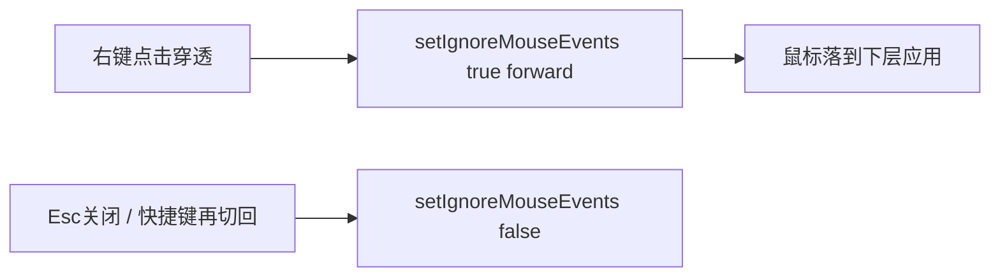
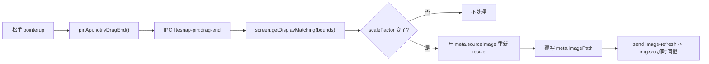

<!--
  Source of truth for LiteLauncher planning docs.
  Migrated from Cursor plan: litesnap体验三件套_3301907e.plan.md
  Local Cursor copy may still exist under ~/.cursor/plans/ — prefer this repo path.
-->
---
name: LiteSnap体验三件套
overview: 完善 LiteSnap 三类高频体验：贴图点击穿透与一键关闭全部、轻量截图历史、取色闭环（最近色板 + 独立取色模式），并新增贴图跨不同缩放屏拖动时的清晰度重算。
todos:
  - id: pin-close-all
    content: 贴图：closeAllPinnedWindows + 面板/右键「关闭全部」+ IPC
    status: completed
  - id: pin-click-through
    content: 贴图：单张点击穿透 IPC/菜单 + 退出穿透快捷键（光标最近窗）
    status: completed
  - id: history-store
    content: SQLite litesnap_history + history-store 落盘/淘汰 + settings 开关/上限
    status: completed
  - id: history-commit-hook
    content: commitCapture/F3 成功写入历史；IPC list/copy/pin/delete/clear
    status: completed
  - id: history-panel
    content: LiteSnap 面板 history 子视图 + snap history 命令
    status: completed
  - id: color-recent
    content: loupe C 复制写入 recentColors + 工具栏最近色点
    status: completed
  - id: color-mode
    content: F4 独立取色模式（overlay mode=color）+ 设置快捷键
    status: completed
  - id: pin-dpi-rebake
    content: 贴图跨屏 DPI 重算：保留源图 + dragend 触发重采样 + 免刷新换图
    status: completed
  - id: tests-verify
    content: 更新回归测试，build + 针对性 dist 测试
    status: completed
isProject: false
---

# LiteSnap 贴图 / 历史 / 取色计划

## 范围与明确不做

本版三块：

1. **贴图体验**：点击穿透（单张）+ 关闭全部贴图
2. **截图历史**：最近 N 张落盘 + LiteSnap 面板可再复制 / 再贴图 / 删除
3. **取色闭环**：截图 loupe 复制时记最近色；另加独立取色模式（冻结当前屏，专用操作）
4. **贴图跨屏 DPI 重算**：贴图在拖拽结束时检测所在屏缩放变化，用保留的原始高清源图重新采样，避免从低缩放屏拖到高缩放屏（如 100% → 150%）时变糊

明确不做：长截图、贴图分组、完整历史管理后台、实时无遮罩跟屏取色、拖拽过程中连续重算（只在松手时判定一次）。

默认决策（已拍板）：

- 历史元数据走 **SQLite 新表**（与文档一致），文件落在 `userData/litesnap/history/`，不冲到用户「保存目录」里的每一张 F1。  
- 点击穿透开启后，**右键不可达**：用贴图窗口 `before-input-event` / 全局某键 **再切回**（见下），并在菜单文案提示「再次点击穿透或 Esc 关闭」。  
- 取色：先做 **最近色板 + 独立取色模式（F4 默认可改）**，复用现有 overlay 冻结帧与 loupe，不做原生持续采色。  
- 贴图 DPI 重算只在**拖拽松手（pointerup）时判定一次**，不在 `moveBy` 的每次 `pointermove` 里做，避免拖动时反复重采样导致卡顿；窗口的 DIP 宽高（`baseWidth/baseHeight/lastScale`）保持不变，只换底图分辨率，不会和 v1.0.41 的「拖动不再变大」修复冲突。

---

## 一、贴图：点击穿透 + 关闭全部

主要文件：`[src/main/litesnap/pin-window-manager.ts](src/main/litesnap/pin-window-manager.ts)`、`[src/preload/litesnap-pin.ts](src/preload/litesnap-pin.ts)`、`[src/renderer/plugin-panel-impls.ts](src/renderer/plugin-panel-impls.ts)`、`[src/shared/litesnap.ts](src/shared/litesnap.ts)`、`[src/main/index.ts](src/main/index.ts)`

### 关闭全部

- 在 `LiteSnapPinWindowManager` 新增 `closeAllPinnedWindows(): { count: number }`：遍历 `this.windows` 逐个 `close()`，清 `hiddenByManager`。  
- IPC：`liteSnapCloseAllPinnedWindows`（channels → ipc → preload → panel）。  
- LiteSnap 面板主视图在「隐藏/显示全部贴图」旁加 **「关闭全部贴图」**。  
- 贴图右键菜单增加 **「关闭所有贴图」**（主进程 pin IPC，由 manager 执行）。

### 点击穿透（单张）




- `PinWindowMeta` 增加 `clickThrough: boolean`。  
- 新增 IPC `litesnap-pin:set-click-through`（preload `setClickThrough`）。  
- 主进程：`window.setIgnoreMouseEvents(enabled, { forward: true })`；菜单项 **「点击穿透」** 切换勾选态（可用菜单文案或 pin HTML 内状态）。  
- **退出穿透**：  
  - 该贴图仍 `focusable` 时 Esc 关闭（现有）；  
  - 另注册可配置快捷键（默认建议与截图系并列，如设置项 `togglePinClickThroughShortcut`，默认空或 `Ctrl+Shift+T`）——命中后对**光标所在屏最上/最近贴图**或**全部可见贴图**切换穿透；实现取 **光标最近的贴图窗口**（`getBounds` 含点优先，否则最近中心）。
- 设置页增加开关文案即可，**首版不做「新建贴图默认穿透」**，避免用户建完点不到。

### 回归

- `[src/test/litesnap-plugin-source.test.ts](src/test/litesnap-plugin-source.test.ts)`：断言 `closeAllPinnedWindows`、`setIgnoreMouseEvents`、菜单 `click-through` / `关闭所有`、panel 按钮。

---

## 二、轻量截图历史

### 数据

- `[src/main/database.ts](src/main/database.ts)` 增表：

```sql
CREATE TABLE IF NOT EXISTS litesnap_history (
  id TEXT PRIMARY KEY,
  filePath TEXT NOT NULL,
  thumbPath TEXT,
  width INTEGER NOT NULL,
  height INTEGER NOT NULL,
  source TEXT NOT NULL, -- capture-copy | capture-save | capture-pin | clipboard-pin
  createdAt INTEGER NOT NULL
);
```

- 新模块 `[src/main/litesnap/history-store.ts](src/main/litesnap/history-store.ts)`：`add` / `list(limit)` / `remove` / `clear` / 超限按 `createdAt` 删文件+行。  
- 文件目录：`app.getPath("userData")/litesnap/history/`（原图 PNG；可选同目录 `_thumb.jpg` 缩小预览）。  
- Settings（`[src/shared/litesnap.ts](src/shared/litesnap.ts)`）：`historyEnabled: boolean`（默认 true）、`historyMaxItems: number`（默认 20，clamp 5–50）。

### 写入时机

在 `[capture-session-manager.ts](src/main/litesnap/capture-session-manager.ts)` `commitCapture` 成功路径（copy / save / pin）对 **裁剪后带标注的最终图** 调用 history `add`（save 若已写入用户目录，history 可再存一份副本或记录 `filePath` 指向用户文件——**统一再写一份到 history 目录**，避免用户删保存文件后历史断链）。  
F3 剪贴板贴图成功也可可选写入（`source: clipboard-pin`）。

### IPC / UI

- Channels：`liteSnapListHistory` / `liteSnapDeleteHistoryItem` / `liteSnapClearHistory` / `liteSnapHistoryCopy` / `liteSnapHistoryPin`。  
- LiteSnap 面板增加子视图 `history`：缩略图网格、复制、贴图、删除、清空；设置里增加历史开关与上限。  
- 插件查询别名：`snap history` / `截图历史` → 打开面板 history 视图。

### 回归

- 历史 store 单测（temp dir + sqlite）或源码级断言表结构 + commit 写入钩子 + panel `preferredView: "history"`。

---

## 三、取色闭环

### A. 最近色板（小改）

- Overlay loupe 按 `C` 复制 HEX 成功后：IPC / setting patch 把该色 push 进 `LiteSnapSettings.recentColors: string[]`（最多 8，去重置顶）。  
- 标注工具栏色板前展示「最近」色点（点一下设为当前标注色）。  
- Settings normalize 保证数组合法 HEX。

### B. 独立取色模式（主功能）

- 默认快捷键 **F4**（`LITESNAP_DEFAULT_COLOR_SHORTCUT`，可与 F1/F3 一样在设置修改）。  
- `startColorCapture()`：复用 `startCaptureInternal` 流程，但 overlay state 带 `mode: "color"`（扩展 `[LiteSnapOverlayState](src/shared/litesnap.ts)`）。  
- Overlay 在 color 模式：隐藏框选/标注工具条；只保留 loupe + HEX/RGB；**单击或 `C` 复制**；Esc 退出；不进入选区。  
- 复制成功同样写入 `recentColors`。  
- 插件命令：`color` / `取色`。

### 回归

- channels / preload / shortcut 注册断言；overlay 对 `mode === "color"` 分支断言；recentColors normalize 断言。

---

## 四、贴图跨屏 DPI 重算

背景：贴图窗口的 DIP 尺寸（CSS 里 `` 走 `object-fit: fill` 撑满容器）本身不会因为拖到不同缩放屏而变化，真正的问题是**底图分辨率是按创建时那块屏的 `scaleFactor` 烤的**——从 100% 拖到 150% 屏时会明显发糊；反方向（150% → 100%）视觉上问题不大（高清图缩小显示不糊），但也一并处理以保持逻辑一致。

主要文件：`[src/main/litesnap/pin-window-manager.ts](src/main/litesnap/pin-window-manager.ts)`



### 主进程改动

- `PinWindowMeta` 增加：
  - `sourceImage: NativeImage`：`pinImage()` 收到的**原始未缩放**图（裁剪后的完整分辨率截图/剪贴板图），整个贴图窗口生命周期内持有，随 `closed` 一并释放。
  - `bakedScaleFactor: number`：当前底图是按哪个 `scaleFactor` 烤的，初始化为创建时 `display.scaleFactor`。
  - `usePng: boolean`：创建时是否用 PNG（`imageLikelyHasTransparency` 结果），重烤时保持同一判断避免文件名/格式跳变。
- 新增 IPC channel `litesnap-pin:drag-end`（`PIN_DRAG_END_CHANNEL`），`ensurePinDragEndHandler()` 处理：
  1. 从 `event.sender` 取 window + `pinWindowMeta`；无 `sourceImage` 直接返回（兜底旧路径）。
  2. `const bounds = window.getBounds(); const display = screen.getDisplayMatching(bounds);`
  3. 若 `display.scaleFactor === meta.bakedScaleFactor` 直接返回（多数拖拽不跨屏，零开销）。
  4. 否则用 `preparePinDisplayImage(meta.sourceImage, meta.baseWidth, meta.baseHeight, display.scaleFactor)` 重新生成底图（复用现有函数，源头换成高清 `sourceImage` 而不是已经烤过的旧图，避免多次重采样降质）。
  5. 按 `meta.usePng` 覆写同一 `meta.imagePath`（文件名不变），更新 `meta.bakedScaleFactor = display.scaleFactor`。
  6. `window.webContents.send(PIN_IMAGE_UPDATED_CHANNEL)` 通知渲染侧刷新。
- `pinImage()` 里把传入的原始 `image` 存进 `meta.sourceImage`（而不是只存烤好的 `displayImage`），其余创建逻辑不变。

### 贴图 HTML / preload 改动

- `[src/preload/litesnap-pin.ts](src/preload/litesnap-pin.ts)` 增加 `notifyDragEnd()`（送 `PIN_DRAG_END_CHANNEL`）和 `onImageRefresh(cb)`（监听 `PIN_IMAGE_UPDATED_CHANNEL`）。
- `buildPinWindowHtml` 内联脚本：
  - 现有 `pointerup` / `pointercancel` 里，若 `dragging` 为真，结束时调用 `pinApi?.notifyDragEnd?.()`。
  - 监听 `pinApi.onImageRefresh(() => { img.src = imgBaseSrc + "?v=" + Date.now(); })`，用查询串加时间戳强制 `file://` 重新取图，不做整页 `reload()`（避免边框/菜单等本地 DOM 状态丢失）。

### 权衡与说明

- 只在**拖拽松手**判定一次，不在 `moveBy` 连续判定，避免拖动过程中反复 `resize()` + 写文件造成卡顿；跨屏这件事本身发生频率低，松手判定足够及时。
- 持有 `sourceImage`（原始分辨率）会让每个贴图窗口多占一份内存，直到窗口关闭；配合本计划一里的「关闭全部贴图」，用户可以方便地一次性释放。
- 缩放（滚轮 zoom）不受影响：`resolvePinWindowSize` 只用 `baseWidth/baseHeight/lastScale`，重烤只换底图像素，不碰窗口 `setBounds` 的宽高来源，因此不会和已修复的「拖动变大」问题打架。

### 回归

- `[src/test/litesnap-plugin-source.test.ts](src/test/litesnap-plugin-source.test.ts)`：断言 `sourceImage` / `bakedScaleFactor` 字段、`PIN_DRAG_END_CHANNEL` handler、`getDisplayMatching` 触发重烤逻辑、`PIN_IMAGE_UPDATED_CHANNEL` 发送；`pinSource` 断言内联脚本里 `notifyDragEnd` 调用与 `onImageRefresh` 刷新逻辑。

---

## 验证顺序（符合 AGENTS.md）

1. 源码回归（litesnap + panel + settings migration/normalize）
2. `pnpm run build`
3. 串行 `node dist/test/litesnap-plugin-source.test.js` 等针对性测试
4. 批次结束再视需要 `test:e2e:litesnap`（不在开发中途反复 smoke）

---

## 建议发布形态

收口后作为 **v1.0.43**（或并入下一小版本）：贴图穿透/关全部 + 跨屏 DPI 重算 + 截图历史 + 取色模式/最近色。