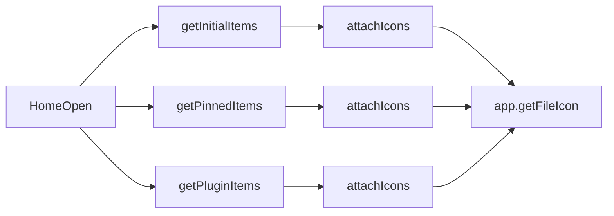

<!--
  Source of truth for LiteLauncher planning docs.
  Migrated from Cursor plan: performance_round_three_7ae0ae50.plan.md
  Local Cursor copy may still exist under ~/.cursor/plans/ — prefer this repo path.
-->
---
name: Performance Round Three
overview: 在已完成启动、搜索 worker、剪贴板局部刷新和 SQLite 优化后，下一轮以均衡方案继续降低首页图标解析重复成本，并补齐首页/CodeAgent 交互层面的轻量 DOM 更新。
todos:
  - id: icon-memory-cache
    content: 在 ipc.ts 为 attachIcon/resolveIconData 增加进程内 LRU 缓存，避免重复解析同一应用图标
    status: completed
  - id: home-sections-ipc
    content: 新增 getHomeSections IPC，首页空查询改为单次请求并统一 attachIcons
    status: completed
  - id: mouse-hover-highlight
    content: 首页 mouseenter 复用 updateSelectionHighlight，补齐鼠标悬停 active 样式
    status: completed
  - id: codeagent-partial-refresh
    content: CodeAgent Switch 详情/列表选择改为局部刷新，结构性变化仍整面板重建
    status: completed
  - id: verify-round-three
    content: 运行 typecheck、build 和相关回归测试
    status: completed
isProject: false
---

# 第三轮性能优化计划

## 背景

前两轮已完成：
- 启动 catalog 缓存 + 后台刷新、图标并发限流、键盘选择局部高亮
- 搜索 worker 常驻状态、剪贴板工作台选择/详情局部刷新、SQLite WAL/busy timeout

当前剩余的主要热点：

- [`src/main/ipc.ts`](src/main/ipc.ts) 的 `attachIcon()` 每次 IPC 都会重新走 `resolveIconData()`，没有进程内缓存。
- 首页空查询在 [`src/renderer/renderer.ts`](src/renderer/renderer.ts) 里并行触发 3 个 IPC，每个都单独 `attachIcons()`。
- 键盘选择已局部更新，但 `bindResultInteractions()` 的 `mouseenter` 只改 `selectedIndex`，不更新 `active` 样式。
- [`src/renderer/plugin-panel-impls.ts`](src/renderer/plugin-panel-impls.ts) 的 `selectCodeAgentSwitchDetail()` 仍调用 `renderList()` 整面板重建。

## 优先做

### 1. 主进程图标解析缓存

- 在 [`src/main/ipc.ts`](src/main/ipc.ts) 增加基于 `target` / 图标路径的内存缓存（Map + 简单 LRU 或上限条数）。
- `attachIcon()` 命中缓存时直接返回 data URL，未命中才调用 `app.getFileIcon()` 并写入缓存。
- 缓存只作用于进程内，不改变数据库 catalog 结构；catalog 重建后缓存可整体保留（key 基于稳定标识）。
- 预期收益：第二次打开首页、翻页、重复搜索时显著减少 IO/CPU 峰值。

### 2. 首页分区 IPC 合并

- 新增共享 channel，例如 `getHomeSections`，在 [`src/shared/channels.ts`](src/shared/channels.ts)、[`src/preload/index.ts`](src/preload/index.ts)、[`src/main/ipc.ts`](src/main/ipc.ts) 注册。
- 主进程一次返回 `{ recent, pinned, plugin }`，只对合并后的 item 列表做一次 `attachIcons()`（配合图标缓存效果更好）。
- [`src/renderer/renderer.ts`](src/renderer/renderer.ts) 首页空查询路径改为单次 IPC；保留原 `getInitialItems` / `getPinnedItems` / `getPluginItems` 兼容其他调用点。
- 有查询的搜索首页仍可继续并行请求，但会受益于图标缓存。

### 3. 首页鼠标悬停轻量高亮

- 复用 [`src/renderer/renderer.ts`](src/renderer/renderer.ts) 现有 `updateSelectionHighlight()` / `canUpdateSelectionHighlightInPlace()`。
- 在 `bindResultInteractions()` 的 `mouseenter` 中，从“只改 `selectedIndex`”改为“局部切换 active 行”。
- 保持 click/contextmenu 现有行为不变，避免影响执行和右键菜单。

### 4. CodeAgent Switch 局部刷新

- 参照剪贴板工作台模式，在 [`src/renderer/plugin-panel-impls.ts`](src/renderer/plugin-panel-impls.ts) 提取：
  - 详情区重建函数（provider/profile 详情）
  - 列表 active/selected 状态更新函数
- `selectCodeAgentSwitchDetail()` 改为局部刷新，不再 `renderList()`。
- 数据加载、切换 provider、执行命令等结构性变化仍走完整 `renderList()`。

## 视情况做

- 搜索翻页仅切页时复用 renderer 内已有 `launchItems` 缓存，避免 `changeSearchResultPage()` 再次整包 IPC。
- 剪贴板工作台 `toggle-collect` / `toggle-sensitive` 的 toolbar badge 局部刷新，进一步减少整面板重建。

## 暂不建议做

- 继续大改 LiteSnap overlay。
- 迁移 UI 框架或重写搜索算法。
- 关闭剪贴板自动采集。

## 验证方式

- `pnpm run typecheck`
- `pnpm run build`
- `node dist/test/launcher-main-flow-regression.test.js`
- `node dist/test/plugin-panel-impls-regression.test.js`
- `node dist/test/search-section-grid-style.test.js`
- 若新增 channel / preload 暴露，补一条 source regression 断言
- 发版前再跑 `pnpm run test:regression`
