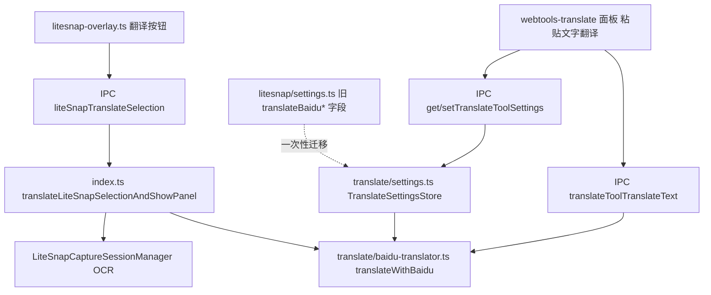

<!--
  Source of truth for LiteLauncher planning docs.
  Migrated from Cursor plan: 拆分翻译功能为独立插件_2b8c57dd.plan.md
  Local Cursor copy may still exist under ~/.cursor/plans/ — prefer this repo path.
-->
---
name: 拆分翻译功能为独立插件
overview: 把 LiteSnap 内置的百度翻译能力（凭证设置 + 文本翻译框）拆分成一个独立的可选插件 webtools-translate；LiteSnap 遮罩层的「截图翻译」按钮继续留在 LiteSnap 里，但底层改为调用新插件提供的翻译服务和设置，避免重复实现；旧的 LiteSnap 百度翻译设置会在首次读取时自动迁移到新插件的独立设置存储。
todos:
  - id: shared-types
    content: 新增 src/shared/translate.ts，精简 src/shared/litesnap.ts 中的翻译相关类型
    status: completed
  - id: main-translate-module
    content: 新建 src/main/translate/{baidu-translator.ts,settings.ts}，含旧设置迁移逻辑，删除旧 src/main/litesnap/baidu-translator.ts
    status: completed
  - id: new-plugin
    content: 新建 src/main/plugins/webtools-translate/index.ts 并注册到 plugins/index.ts（DEFAULT_VISIBLE_PLUGIN_IDS），补充图标
    status: completed
  - id: ipc-wiring
    content: 更新 channels.ts / ipc.ts / preload/index.ts / main/index.ts：新增 translateTool* 通道与 provider，删除 liteSnapTranslateText，改造截图翻译内部实现
    status: completed
  - id: renderer-panel
    content: 在 plugin-panel-impls.ts 新增 webtools-translate 面板（文本翻译+设置），精简 LiteSnap 设置面板中的百度翻译区块，更新 plugin-constants.ts / plugin-handler-config.ts
    status: completed
  - id: tests
    content: 更新/新增回归测试（litesnap-plugin-source、visible-plugins-regression、plugin-panel-impls-regression、新 webtools-translate-plugin-source、设置迁移单测）
    status: completed
  - id: verify
    content: build + 针对性回归测试，必要时跑一次截图翻译与新插件文本翻译的 smoke 验证
    status: completed
isProject: false
---

# PRD：将 OCR 翻译功能拆分为独立插件（webtools-translate）

## 背景与现状

翻译功能目前完全内嵌在 LiteSnap 插件里，分散在：

- 共享类型：[src/shared/litesnap.ts](src/shared/litesnap.ts)（`LiteSnapBaiduTranslateEngine`、`LiteSnapSettings.translateBaidu*` 四个字段、`LiteSnapTranslateSelectionInput/Result`、`LiteSnapTranslateTextInput/Result`）
- 百度翻译签名/分片/错误码工具：[src/shared/baidu-translate.ts](src/shared/baidu-translate.ts)（纯函数，与 LiteSnap 无耦合，可直接复用，不需要动）
- 百度翻译请求封装：[src/main/litesnap/baidu-translator.ts](src/main/litesnap/baidu-translator.ts)（`translateWithBaidu`）
- 设置持久化：[src/main/litesnap/settings.ts](src/main/litesnap/settings.ts)（`LiteSnapSettingsStore`，翻译凭证与截图设置混存在同一个 `litesnapSettings` DB key 下）
- 主进程编排：[src/main/index.ts](src/main/index.ts) 中的 `translateLiteSnapText`（独立文本翻译）与 `translateLiteSnapSelectionAndShowPanel`（截图选区 OCR + 翻译 + 面板下发）
- IPC：`liteSnapTranslateSelection` / `liteSnapTranslateText`（[src/shared/channels.ts](src/shared/channels.ts)、[src/main/ipc.ts](src/main/ipc.ts)、[src/preload/index.ts](src/preload/index.ts)）
- 渲染层：遮罩层「截图翻译」按钮（[src/renderer/litesnap-overlay.ts](src/renderer/litesnap-overlay.ts) / [src/renderer/litesnap-overlay.html](src/renderer/litesnap-overlay.html)），LiteSnap 面板里的翻译结果视图和设置面板内嵌的百度翻译凭证 + 文本翻译测试框（[src/renderer/plugin-panel-impls.ts](src/renderer/plugin-panel-impls.ts) 约 15719-16060 行）

## 拆分方案（已与用户确认）

1. **截图翻译入口保留在 LiteSnap**：遮罩层「翻译」按钮、选区 OCR、`preferredView: "translate"` 结果面板都不动，只是底层改为调用新插件暴露的翻译函数与设置存储，不再自己维护百度翻译逻辑。
2. **新插件默认可见但可选**：加入 `DEFAULT_VISIBLE_PLUGIN_IDS`，不加入 `REQUIRED_VISIBLE_PLUGIN_IDS`（用户可在设置里隐藏）。
3. **自动迁移旧设置**：新插件首次读取自己的设置时，如果新 DB key 不存在，就从旧的 `litesnapSettings.translateBaidu*` 字段回填一次，用户无需重新填百度翻译凭证。

## 架构示意

## 具体改动

### 1. 共享类型：新增 `src/shared/translate.ts`
- `TranslateEngine = "standard" | "llm"`（原 `LiteSnapBaiduTranslateEngine`）
- `TranslateSettings { baiduAppId, baiduSecret, baiduEngine, baiduApiKey }` + `createDefaultTranslateSettings()`
- `TranslateTextInput { text, appId?, secret?, apiKey?, engine? }`
- `TranslateResult { ok, sourceText, translatedText, message }`（同时供文本翻译和截图选区翻译复用）

`src/shared/litesnap.ts` 改动：
- 删除 `LiteSnapBaiduTranslateEngine`、`LiteSnapSettings` 里的 4 个 `translateBaidu*` 字段、`LiteSnapTranslateTextInput/Result`
- `LiteSnapTranslateSelectionResult` 直接复用/等价于 `translate.ts` 的 `TranslateResult`
- 保留 `LiteSnapPanelPayload` 的 `preferredView: "translate"`、`translateSourceText`、`translateText`（截图翻译结果面板仍在 LiteSnap 里显示）

### 2. 主进程：新增 `src/main/translate/` 目录
- `baidu-translator.ts`：从 [src/main/litesnap/baidu-translator.ts](src/main/litesnap/baidu-translator.ts) 原样迁移，类型改为从 `../../shared/translate` 导入；删除旧文件。
- `settings.ts`：新增 `TranslateSettingsStore`，比照 [src/main/litesnap/settings.ts](src/main/litesnap/settings.ts) 的 `LiteSnapSettingsStore` 写法，DB key 用 `translateToolSettings`；`getSettings()` 首次无数据时，尝试读取旧 `litesnapSettings` JSON 里的 `translateBaidu*` 字段做一次性迁移种子数据，然后按新 key 落盘。

`src/main/litesnap/settings.ts` 改动：`normalizeLiteSnapSettings` 与 `createDefaultLiteSnapSettings`（在 shared 层）去掉 `translateBaidu*` 相关逻辑。

### 3. 新插件：`src/main/plugins/webtools-translate/index.ts`
- `PLUGIN_ID = "webtools-translate"`，标题「文本翻译」，副标题「粘贴文字在线翻译为中文（百度翻译）」
- `QUERY_ALIASES`: `translate`, `fanyi`, `wt-translate`, `翻译`, `文本翻译`, `百度翻译`
- `execute()` 打开面板，携带 `createDefaultTranslateSettings()`（同步默认值，与 LiteSnap 现有模式一致），真正的持久化设置由渲染层挂载后通过 IPC 拉取刷新。
- 图标：在 [src/main/plugins/webtools-shared/index.ts](src/main/plugins/webtools-shared/index.ts) 的 `ICON_COLOR_BY_PLUGIN_ID` / `getIconSymbolSvg` 新增 `webtools-translate` 分支（复用遮罩层翻译按钮的字形）。

在 [src/main/plugins/index.ts](src/main/plugins/index.ts)：
- `ALL_PLUGINS` 中加入 `webtoolsTranslatePlugin`
- `DEFAULT_VISIBLE_PLUGIN_IDS` 中加入 `"webtools-translate"`（不加入 `src/main/index.ts` 的 `REQUIRED_VISIBLE_PLUGIN_IDS`）

### 4. IPC 改动
`src/shared/channels.ts`：
- 删除 `liteSnapTranslateText`（不再需要，独立文本翻译走新通道）
- 新增 `getTranslateToolSettings`、`setTranslateToolSettings`、`translateToolTranslateText`
- 保留 `liteSnapTranslateSelection`（截图翻译入口不变）

`src/main/ipc.ts`：
- 新增 `TranslateToolProvider` 类型（`getSettings`、`updateSettings`、`translateText`），仿照现有 `LiteSnapProvider` 写法；`IpcOptions` 增加 `translateToolProvider` 字段并注册对应 handler
- `liteSnapProvider.translateSelection` 签名不变，但其实现（在 `index.ts`）内部改为调用 `translateWithBaidu` + `TranslateSettingsStore`
- 移除 `liteSnapTranslateText` 相关 handler

`src/preload/index.ts`：暴露 `getTranslateToolSettings`、`setTranslateToolSettings`、`translateToolTranslateText`；移除 `liteSnapTranslateText`。

`src/main/index.ts`：
- 实例化 `translateSettingsStore = new TranslateSettingsStore(db)`
- `translateLiteSnapSelectionAndShowPanel` 改为调用 `translateSettingsStore.getSettings()` + `translateWithBaidu`（来自 `./translate/baidu-translator`），不再依赖 `liteSnapSettingsStore` 里的翻译字段
- 删除 `translateLiteSnapText`（原独立文本翻译编排函数），新增等价的 `translateTextForTool` 供新插件 IPC 使用
- 在 `registerIpcHandlers` 调用处补充 `translateToolProvider: { getSettings, updateSettings, translateText }`

### 5. 渲染层：`src/renderer/plugin-panel-impls.ts`
- 新增 `webtools-translate` 面板渲染分支：一个「原文」输入框 + 翻译按钮 + 「译文」结果框 + 复制按钮，以及一个可切换的设置子视图（翻译引擎 select、百度 AppID、密钥、API Key 四个字段 + 保存按钮）。这部分内容基本是把现有 LiteSnap 设置面板里 15949-16060+ 行的百度翻译字段和文本翻译测试框搬过来，改成调用新的 `translateToolTranslateText` / `getTranslateToolSettings` / `setTranslateToolSettings`。
- 新增状态变量 `translateToolPanelData`、`translateToolPanelView`（"main" | "settings"）等，参照现有 `liteSnapPanelData` / `liteSnapPanelView` 命名习惯。
- 新增 `hydrateTranslateToolPanelFromSettings()`，参照 [hydrateLiteSnapPanelFromSettings](src/renderer/plugin-panel-impls.ts) 的写法，在面板打开时调用一次。
- LiteSnap 设置面板：移除百度翻译凭证字段与文本翻译测试框（15949-16060+ 行），如果用户需要测试翻译效果，引导去新插件；LiteSnap 的翻译结果视图（15719-15839 行）本身不用大改，只是文案上可以提示"翻译设置已迁移到「文本翻译」插件"。
- `src/renderer/plugin-constants.ts` 新增 `WEBTOOLS_TRANSLATE_PLUGIN_ID: "webtools-translate"`
- `src/renderer/plugin-handler-config.ts` 新增一条映射（formSelector + enterActionKey，例如 `translate-run`）

### 6. 测试更新
- [src/test/litesnap-plugin-source.test.ts](src/test/litesnap-plugin-source.test.ts)：更新/拆分约 1281-1352 行的翻译相关断言——保留截图翻译（overlay 按钮、`liteSnapTranslateSelection`、`preferredView: "translate"`）断言，删除/迁移文本翻译设置相关断言到新测试文件。
- 新增 `src/test/webtools-translate-plugin-source.test.ts`：覆盖新插件注册、图标、IPC 通道、面板字段、设置迁移逻辑源码级断言（沿用仓库现有的"读取编译产物源码做正则断言"测试风格）。
- [src/test/visible-plugins-regression.test.ts](src/test/visible-plugins-regression.test.ts)：更新 `DEFAULT_VISIBLE_PLUGIN_IDS` 相关断言，加入 `webtools-translate`。
- [src/test/plugin-panel-impls-regression.test.ts](src/test/plugin-panel-impls-regression.test.ts)：按 CLAUDE.md 约定为新插件补充面板注册断言。
- [src/test/baidu-translate.test.ts](src/test/baidu-translate.test.ts) 不变（测的是纯共享工具函数）。
- 新增迁移逻辑的单元测试（旧 `litesnapSettings.translateBaidu*` → 新 `translateToolSettings` 一次性回填）。

### 7. 验证步骤（遵循 AGENTS.md 顺序）
1. 触碰到的源码级回归测试（build 后 `node dist/test/...`）
2. `pnpm run build`
3. 视情况跑一次针对性 smoke（截图翻译 + 新插件文本翻译）

## 风险与注意事项

- 迁移逻辑只做"读取时回填"，不删除旧字段，避免破坏尚未升级完成时的兼容性；后续版本可以再清理。
- `liteSnapTranslateText` 通道删除属于破坏性变更，需要确认没有其它调用方（已核实仅设置面板测试框使用，随此次改造一起搬迁）。
- 新插件默认加入可见列表后，需要更新版本发布说明（docs/releases）告知用户翻译设置迁移到新插件。
